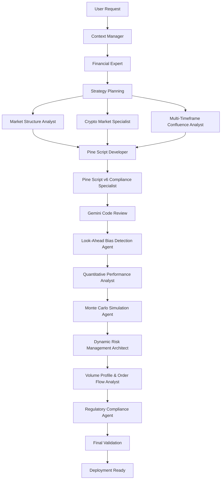

# AI Collaboration Workflow for TradingView Strategy Development

## Overview

This document defines the comprehensive collaboration workflow between specialized AI agents for institutional-grade Pine Script v6 trading strategy development.

## Workflow Architecture

### Core Development Pipeline



## Phase-by-Phase Collaboration

### Phase 1: Strategy Conception & Planning

#### Lead Agent: Financial Expert
**Responsibilities:**
- Analyze user requirements and trading objectives
- Design high-level strategy architecture
- Define performance targets and risk parameters
- Create initial development plan

**Collaborative Agents:**
- **Context Manager**: Provide codebase context and existing patterns
- **Market Structure Analyst**: Analyze market conditions and structure requirements
- **Crypto Market Specialist**: Provide crypto-specific insights (for crypto strategies)

**Deliverables:**
- Strategy specification document
- Performance targets and success criteria
- Risk management framework outline
- Development roadmap

**Quality Gates:**
- [ ] Strategy objectives clearly defined
- [ ] Risk parameters within acceptable limits
- [ ] Performance targets realistic and measurable
- [ ] Market conditions analysis complete

---

### Phase 2: Technical Architecture & Implementation

#### Lead Agent: Pine Script Developer
**Responsibilities:**
- Implement core strategy logic and structure
- Develop modular architecture following template patterns
- Create comprehensive testing framework
- Ensure Pine Script v6 compliance

**Collaborative Agents:**
- **Pine Script v6 Compliance Specialist**: Real-time syntax validation and optimization
- **Multi-Timeframe Confluence Analyst**: Cross-timeframe signal validation
- **Volume Profile & Order Flow Analyst**: Advanced volume analysis integration

**Deliverables:**
- Complete Pine Script v6 strategy implementation
- Comprehensive test suites (basic and enhanced)
- Technical documentation
- Performance optimization recommendations

**Quality Gates:**
- [ ] Zero Pine Script compilation errors
- [ ] Modular architecture implemented
- [ ] Test framework comprehensive (25+ basic, 40+ enhanced tests)
- [ ] Performance optimized for TradingView platform

---

### Phase 3: Quality Assurance & Code Review

#### Lead Agent: Gemini
**Responsibilities:**
- Comprehensive code review and quality validation
- Architecture review and optimization recommendations
- Risk management system validation
- Documentation quality assurance

**Collaborative Agents:**
- **Pine Script v6 Compliance Specialist**: Deep technical validation
- **Look-Ahead Bias Detection Agent**: Backtesting integrity validation
- **Dynamic Risk Management Architect**: Risk system validation

**Deliverables:**
- Code review report with recommendations
- Quality assurance validation
- Risk management system approval
- Technical optimization suggestions

**Quality Gates:**
- [ ] Code quality meets institutional standards
- [ ] Zero look-ahead bias detected
- [ ] Risk management systems validated
- [ ] Documentation professional grade

---

### Phase 4: Statistical Validation & Performance Analysis

#### Lead Agent: Quantitative Performance Analyst
**Responsibilities:**
- Comprehensive statistical analysis of strategy performance
- Advanced performance metrics calculation
- Statistical significance testing
- Performance benchmark validation

**Collaborative Agents:**
- **Monte Carlo Simulation Agent**: Probabilistic validation and robustness testing
- **Look-Ahead Bias Detection Agent**: Ensure statistical validity
- **Dynamic Risk Management Architect**: Risk-adjusted performance analysis

**Deliverables:**
- Comprehensive performance analysis report
- Statistical validation of all claims
- Risk-adjusted performance metrics
- Monte Carlo simulation results

**Quality Gates:**
- [ ] All performance claims statistically validated
- [ ] Monte Carlo simulation confirms robustness
- [ ] Risk-adjusted metrics within targets
- [ ] Statistical significance demonstrated

---

### Phase 5: Market-Specific Validation

#### Lead Agent: Market Structure Analyst (or Crypto Market Specialist for crypto strategies)
**Responsibilities:**
- Market-specific behavior validation
- Regime-specific performance analysis
- Market microstructure impact assessment
- Cross-timeframe validation

**Collaborative Agents:**
- **Multi-Timeframe Confluence Analyst**: Temporal signal validation
- **Volume Profile & Order Flow Analyst**: Volume behavior analysis
- **Dynamic Risk Management Architect**: Market-adaptive risk validation

**Deliverables:**
- Market-specific performance validation
- Regime analysis and behavior documentation
- Cross-timeframe signal confluence analysis
- Market microstructure impact assessment

**Quality Gates:**
- [ ] Performance validated across market regimes
- [ ] Cross-timeframe signals properly aligned
- [ ] Volume analysis supports strategy logic
- [ ] Market-specific risks identified and mitigated

---

### Phase 6: Final Compliance & Deployment Readiness

#### Lead Agent: Regulatory Compliance Agent
**Responsibilities:**
- Regulatory compliance validation
- Risk disclosure documentation
- Institutional-grade documentation review
- Deployment readiness certification

**Collaborative Agents:**
- **All Previous Agents**: Final validation sign-off
- **Context Manager**: Integration with existing repository structure

**Deliverables:**
- Compliance certification
- Risk disclosure documentation
- Final deployment package
- Institutional-grade documentation

**Quality Gates:**
- [ ] Full regulatory compliance achieved
- [ ] Risk disclosures comprehensive and accurate
- [ ] Documentation meets institutional standards
- [ ] All agents provide final approval

---

## Parallel Collaboration Patterns

### Concurrent Analysis Streams

#### Stream 1: Technical Implementation
```
Pine Script Developer ←→ Pine Script v6 Compliance Specialist
           ↓
    Real-time optimization and validation
```

#### Stream 2: Market Analysis
```
Market Structure Analyst ←→ Multi-Timeframe Confluence Analyst ←→ Volume Profile & Order Flow Analyst
                    ↓
    Comprehensive market behavior validation
```

#### Stream 3: Risk & Performance
```
Dynamic Risk Management Architect ←→ Quantitative Performance Analyst ←→ Monte Carlo Simulation Agent
                              ↓
    Comprehensive risk-adjusted performance validation
```

### Cross-Stream Integration Points

1. **Technical-Market Integration**: Pine Script implementation with market analysis validation
2. **Market-Risk Integration**: Market behavior analysis with dynamic risk adaptation
3. **Performance-Compliance Integration**: Statistical validation with regulatory requirements

## Communication Protocols

### Inter-Agent Communication Standards

#### Information Handoff Format
```yaml
handoff:
  from_agent: "Agent Name"
  to_agent: "Agent Name"
  phase: "Development Phase"
  deliverables:
    - "Specific deliverable 1"
    - "Specific deliverable 2"
  quality_gates:
    - gate_name: "Gate Description"
      status: "PASSED/FAILED/PENDING"
  next_actions:
    - "Required action 1"
    - "Required action 2"
  context:
    strategy_type: "BTC 5M Scalping / 4H Swing Trading / etc."
    complexity_level: "Basic/Intermediate/Advanced"
    priority_areas: ["Performance", "Risk Management", "Compliance"]
```

#### Quality Gate Validation Format
```yaml
quality_gate:
  gate_id: "QG_001"
  description: "Pine Script v6 Compliance"
  validator: "Pine Script v6 Compliance Specialist"
  criteria:
    - criterion: "Zero compilation errors"
      status: "PASSED/FAILED"
      evidence: "TradingView compilation log"
    - criterion: "Performance optimization"
      status: "PASSED/FAILED"  
      evidence: "Optimization analysis report"
  overall_status: "PASSED/FAILED"
  timestamp: "2024-XX-XX"
  sign_off: "Agent signature"
```

## Error Handling & Escalation

### Error Classification
1. **Technical Errors**: Pine Script compilation, syntax issues
2. **Logic Errors**: Strategy logic flaws, signal inconsistencies
3. **Performance Errors**: Suboptimal performance, resource issues
4. **Compliance Errors**: Regulatory violations, risk management failures

### Escalation Matrix
| Error Type | Primary Handler | Escalation Path | Resolution Timeline |
|------------|----------------|-----------------|-------------------|
| Technical | Pine Script v6 Compliance Specialist | → Gemini → Financial Expert | 24 hours |
| Logic | Market Structure Analyst | → Financial Expert → User | 48 hours |
| Performance | Quantitative Performance Analyst | → Monte Carlo Agent → Financial Expert | 72 hours |
| Compliance | Regulatory Compliance Agent | → Financial Expert → User | 48 hours |

## Success Metrics & KPIs

### Collaboration Effectiveness
- **Development Velocity**: Time from conception to deployment-ready
- **Quality Gate Pass Rate**: Percentage of quality gates passed on first attempt
- **Error Detection Rate**: Percentage of errors caught before final review
- **Stakeholder Satisfaction**: User feedback on final deliverables

### Technical Excellence
- **Pine Script v6 Compliance**: 100% compliance rate maintained
- **Test Suite Coverage**: ≥90% pass rate on all test suites
- **Performance Optimization**: Measurable improvement in strategy performance
- **Code Quality Score**: Maintained institutional-grade standards

### Strategic Impact
- **Strategy Success Rate**: Percentage of deployed strategies meeting targets
- **Risk Management Effectiveness**: Risk-adjusted performance improvements
- **Market Adaptation**: Strategy performance across different market regimes
- **Innovation Index**: Number of advanced features successfully integrated

This collaboration workflow ensures systematic, high-quality development with clear responsibilities, quality gates, and success metrics at every stage of the strategy development lifecycle.